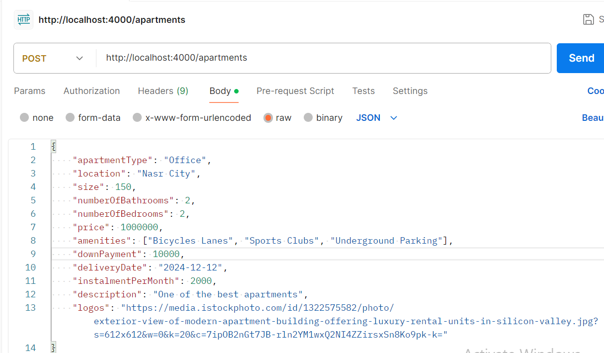
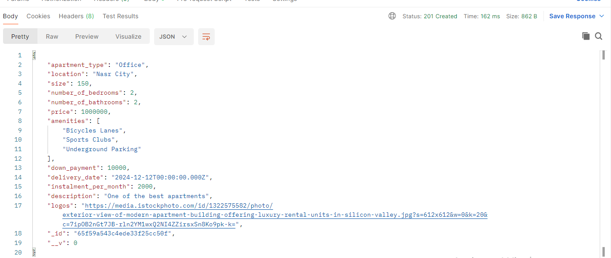
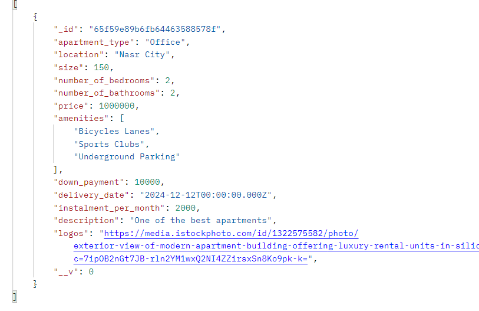
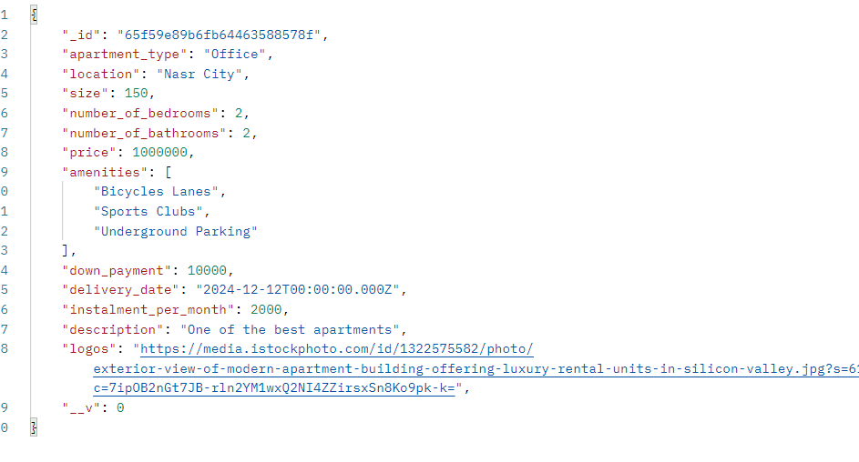

# Nawy-Assessment-

### Steps To Run:

- Make sure that docker is installed and that the docker engine is running
- Navigate to the root dirctory
- Run `docker compose up --build`
- Go to http://localhost:3000/ to view the frontend
- And you can make requests to http://localhost:4000/ to the backend to create new apartments

**Note:** you need to first create an apartment to start viewing a list of them in the frontend

### API Routes:

##### POST /apartments:

This is used to create a new apartment resource in the database

**Paramters:**

1. apartmentType: whether the apartment is an Office, Villa, Apartment, or Studio
2. location: a string represnting the location of the apartment
3. size: a postive integer indicating the apartment size
4. numberOfBathrooms: a postive integer indicating the number of bathrooms
5. numberOfBedrooms: a postive integer indicating the number of bedrooms
6. price: a postive intger integer indicating the price of the apartment
7. downPayment: a postive integer indicating the down payment for the apartment
8. instalmentPerMonth: a psotive integer indicating the instalments per month to pay
9. amenities: a list of possible amenities, "they could be Bicycles Lanes, Sports Clubs, Underground Parking, Clubhouse, Business Hub
10. deliveryDate: a string representing the date format
11. description: a description about the apartment
12. logos: a string for url for the image to display for the apartment

**Example request**:

Example Response:

##### **GET /apartments:**

This is used to fetch all apartments

**Example Response**:

##### GET /apartments/`<id>`

This is used to fetch a a specfic resource by its id

**Example Response:**

